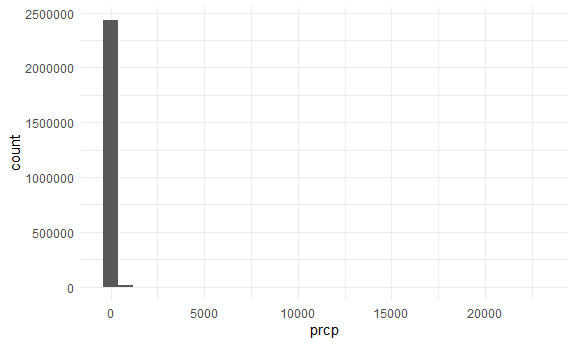
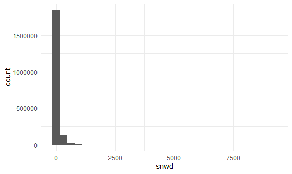
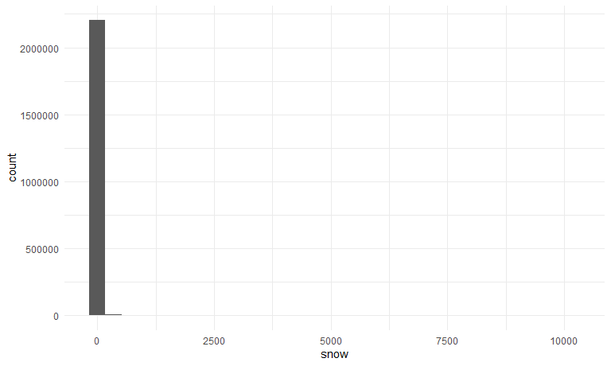
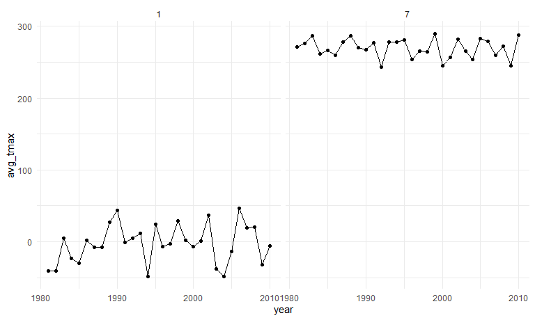
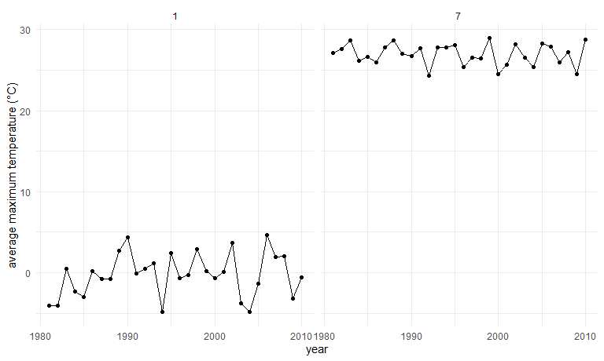

hw3_rw3031
================
Polly Wu (rw3031)
2024-10-05

## library and visual theme set up

# Problem 1

load the NY NOAA dataset

``` r
library(p8105.datasets)
data("ny_noaa")
```

### explore the NY NOAA dataset

``` r
nrow(ny_noaa)
```

    ## [1] 2595176

``` r
ncol(ny_noaa)
```

    ## [1] 7

``` r
summary(ny_noaa)
```

    ##       id                 date                 prcp               snow       
    ##  Length:2595176     Min.   :1981-01-01   Min.   :    0.00   Min.   :  -13   
    ##  Class :character   1st Qu.:1988-11-29   1st Qu.:    0.00   1st Qu.:    0   
    ##  Mode  :character   Median :1997-01-21   Median :    0.00   Median :    0   
    ##                     Mean   :1997-01-01   Mean   :   29.82   Mean   :    5   
    ##                     3rd Qu.:2005-09-01   3rd Qu.:   23.00   3rd Qu.:    0   
    ##                     Max.   :2010-12-31   Max.   :22860.00   Max.   :10160   
    ##                                          NA's   :145838     NA's   :381221  
    ##       snwd            tmax               tmin          
    ##  Min.   :   0.0   Length:2595176     Length:2595176    
    ##  1st Qu.:   0.0   Class :character   Class :character  
    ##  Median :   0.0   Mode  :character   Mode  :character  
    ##  Mean   :  37.3                                        
    ##  3rd Qu.:   0.0                                        
    ##  Max.   :9195.0                                        
    ##  NA's   :591786

``` r
ny_noaa |> 
  ggplot(aes(x = prcp)) + 
  geom_histogram()
```

    ## `stat_bin()` using `bins = 30`. Pick better value with `binwidth`.

    ## Warning: Removed 145838 rows containing non-finite outside the scale range
    ## (`stat_bin()`).



``` r
ny_noaa |> 
  ggplot(aes(x = snow)) + 
  geom_histogram()
```

    ## `stat_bin()` using `bins = 30`. Pick better value with `binwidth`.

    ## Warning: Removed 381221 rows containing non-finite outside the scale range
    ## (`stat_bin()`).


``` r
ny_noaa |> 
  ggplot(aes(x = snwd)) + 
  geom_histogram()
```

    ## `stat_bin()` using `bins = 30`. Pick better value with `binwidth`.

    ## Warning: Removed 591786 rows containing non-finite outside the scale range
    ## (`stat_bin()`).


There are 2595176 observations and 7 variables (id, date, prcp, snow,
snwd, tmax, tmin) in dataset. The variable tmax and tmin are imported as
character variable.

The earliest date for the data is 1981-01-01 and the most recent date is
2012-12-31.

Precipitation ranges from 0 to 22860 (tenths of mm) and 145838
observations do not report precipitation data. Snowfall range from -13
mm to 10160 mm, and 381221 observations’ data on snowfall is missing,
Snow depth range from 0 to 9195 mmm and 591786 observations do not have
snow depth data. All three variables are highly right skewed since there
are a lot of days that there is no rain or snow

``` r
ny_noaa = 
  ny_noaa|>
  mutate(
    tmax = as.numeric(tmax),
    tmin = as.numeric(tmin))

summary(ny_noaa)
```

    ##       id                 date                 prcp               snow       
    ##  Length:2595176     Min.   :1981-01-01   Min.   :    0.00   Min.   :  -13   
    ##  Class :character   1st Qu.:1988-11-29   1st Qu.:    0.00   1st Qu.:    0   
    ##  Mode  :character   Median :1997-01-21   Median :    0.00   Median :    0   
    ##                     Mean   :1997-01-01   Mean   :   29.82   Mean   :    5   
    ##                     3rd Qu.:2005-09-01   3rd Qu.:   23.00   3rd Qu.:    0   
    ##                     Max.   :2010-12-31   Max.   :22860.00   Max.   :10160   
    ##                                          NA's   :145838     NA's   :381221  
    ##       snwd             tmax              tmin        
    ##  Min.   :   0.0   Min.   :-389.0    Min.   :-594.0   
    ##  1st Qu.:   0.0   1st Qu.:  50.0    1st Qu.: -39.0   
    ##  Median :   0.0   Median : 150.0    Median :  33.0   
    ##  Mean   :  37.3   Mean   : 139.8    Mean   :  30.3   
    ##  3rd Qu.:   0.0   3rd Qu.: 233.0    3rd Qu.: 111.0   
    ##  Max.   :9195.0   Max.   : 600.0    Max.   : 600.0   
    ##  NA's   :591786   NA's   :1134358   NA's   :1134420

I change the character variable tmax and tmin into numeric instead.

There are more than 1100,000 observations that have the maximum and
minimum temperature missing within the dataset which is more than 40% of
the observations.

### cleaning the NY_NOAA data

Create separate variables for year, month, and day.

``` r
ny_noaa=
ny_noaa|>
  mutate(year = year(date),
         month = month(date),
         day = day(date))
```

``` r
ny_noaa |> 
  ggplot(aes(x = snow)) + 
  geom_histogram()
```

    ## `stat_bin()` using `bins = 30`. Pick better value with `binwidth`.

    ## Warning: Removed 381221 rows containing non-finite outside the scale range
    ## (`stat_bin()`).


For snowfall the most commonly observed value is 0 since except for cold
winter time there is not any snow.

### average temperatue in January and July

``` r
ny_noaa|>
  filter(month ==1 | month == 7)|>
  group_by(year,month)|>
  summarize(avg_tmax = mean(tmax, na.rm = TRUE))|>
  ggplot(aes(x = year, y=avg_tmax))+
  geom_point()+geom_line()+
  facet_grid(.~month)
```

    ## `summarise()` has grouped output by 'year'. You can override using the
    ## `.groups` argument.



The average maximum temperature in January and July fluctuates a lot.
The years with higher tmax in January tend to have higher tmax in July
as well.

### tmax and tmin and distribution of snowfall

``` r
tmax_tmin_p=
ny_noaa|>
  ggplot(aes(x= tmax, y=tmin))+
  geom_bin2d()+
  theme(legend.position = "right")

snow_p=
ny_noaa|>
  filter(snow>0, snow<100)|>
  group_by(year)|>
  ggplot(aes(x=snow))+
  geom_histogram()

tmax_tmin_p + snow_p
```

    ## Warning: Removed 1136276 rows containing non-finite outside the scale range
    ## (`stat_bin2d()`).

    ## `stat_bin()` using `bins = 30`. Pick better value with `binwidth`.



# Problem 2

# Problem 3
