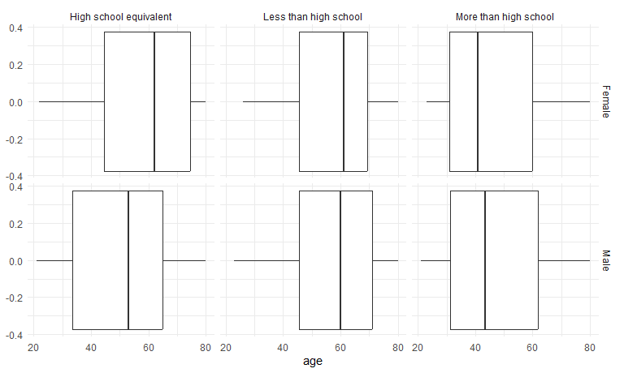

hw3_rw3031
================
Polly Wu (rw3031)
2024-10-05

## library and visual theme set up

# Problem 1

load the NY NOAA dataset

``` r
library(p8105.datasets)
data("ny_noaa")
```

### explore the NY NOAA dataset

``` r
nrow(ny_noaa)
```

    ## [1] 2595176

``` r
ncol(ny_noaa)
```

    ## [1] 7

``` r
summary(ny_noaa)
```

    ##       id                 date                 prcp               snow       
    ##  Length:2595176     Min.   :1981-01-01   Min.   :    0.00   Min.   :  -13   
    ##  Class :character   1st Qu.:1988-11-29   1st Qu.:    0.00   1st Qu.:    0   
    ##  Mode  :character   Median :1997-01-21   Median :    0.00   Median :    0   
    ##                     Mean   :1997-01-01   Mean   :   29.82   Mean   :    5   
    ##                     3rd Qu.:2005-09-01   3rd Qu.:   23.00   3rd Qu.:    0   
    ##                     Max.   :2010-12-31   Max.   :22860.00   Max.   :10160   
    ##                                          NA's   :145838     NA's   :381221  
    ##       snwd            tmax               tmin          
    ##  Min.   :   0.0   Length:2595176     Length:2595176    
    ##  1st Qu.:   0.0   Class :character   Class :character  
    ##  Median :   0.0   Mode  :character   Mode  :character  
    ##  Mean   :  37.3                                        
    ##  3rd Qu.:   0.0                                        
    ##  Max.   :9195.0                                        
    ##  NA's   :591786

``` r
ny_noaa |> 
  ggplot(aes(x = prcp)) + 
  geom_histogram()
```

    ## `stat_bin()` using `bins = 30`. Pick better value with `binwidth`.

    ## Warning: Removed 145838 rows containing non-finite outside the scale range
    ## (`stat_bin()`).


``` r
ny_noaa |> 
  ggplot(aes(x = snow)) + 
  geom_histogram()
```

    ## `stat_bin()` using `bins = 30`. Pick better value with `binwidth`.

    ## Warning: Removed 381221 rows containing non-finite outside the scale range
    ## (`stat_bin()`).


``` r
ny_noaa |> 
  ggplot(aes(x = snwd)) + 
  geom_histogram()
```

    ## `stat_bin()` using `bins = 30`. Pick better value with `binwidth`.

    ## Warning: Removed 591786 rows containing non-finite outside the scale range
    ## (`stat_bin()`).


There are 2595176 observations and 7 variables (id, date, prcp, snow,
snwd, tmax, tmin) in dataset. The variable tmax and tmin are imported as
character variable.

The earliest date for the data is 1981-01-01 and the most recent date is
2012-12-31.

Precipitation ranges from 0 to 22860 (tenths of mm) and 145838
observations do not report precipitation data. Snowfall range from -13
mm to 10160 mm, and 381221 observations’ data on snowfall is missing,
Snow depth range from 0 to 9195 mmm and 591786 observations do not have
snow depth data. All three variables are highly right skewed since there
are a lot of days that there is no rain or snow

``` r
ny_noaa = 
  ny_noaa|>
  mutate(
    tmax = as.numeric(tmax),
    tmin = as.numeric(tmin))

summary(ny_noaa)
```

    ##       id                 date                 prcp               snow       
    ##  Length:2595176     Min.   :1981-01-01   Min.   :    0.00   Min.   :  -13   
    ##  Class :character   1st Qu.:1988-11-29   1st Qu.:    0.00   1st Qu.:    0   
    ##  Mode  :character   Median :1997-01-21   Median :    0.00   Median :    0   
    ##                     Mean   :1997-01-01   Mean   :   29.82   Mean   :    5   
    ##                     3rd Qu.:2005-09-01   3rd Qu.:   23.00   3rd Qu.:    0   
    ##                     Max.   :2010-12-31   Max.   :22860.00   Max.   :10160   
    ##                                          NA's   :145838     NA's   :381221  
    ##       snwd             tmax              tmin        
    ##  Min.   :   0.0   Min.   :-389.0    Min.   :-594.0   
    ##  1st Qu.:   0.0   1st Qu.:  50.0    1st Qu.: -39.0   
    ##  Median :   0.0   Median : 150.0    Median :  33.0   
    ##  Mean   :  37.3   Mean   : 139.8    Mean   :  30.3   
    ##  3rd Qu.:   0.0   3rd Qu.: 233.0    3rd Qu.: 111.0   
    ##  Max.   :9195.0   Max.   : 600.0    Max.   : 600.0   
    ##  NA's   :591786   NA's   :1134358   NA's   :1134420

I change the character variable tmax and tmin into numeric instead.

There are more than 1100,000 observations that have the maximum and
minimum temperature missing within the dataset which is more than 40% of
the observations.

### cleaning the NY_NOAA data

Create separate variables for year, month, and day.

``` r
ny_noaa=
ny_noaa|>
  mutate(year = year(date),
         month = month(date),
         day = day(date))
```

``` r
ny_noaa |> 
  ggplot(aes(x = snow)) + 
  geom_histogram()
```

    ## `stat_bin()` using `bins = 30`. Pick better value with `binwidth`.

    ## Warning: Removed 381221 rows containing non-finite outside the scale range
    ## (`stat_bin()`).


For snowfall the most commonly observed value is 0 since except for cold
winter time there is not any snow.

### average temperatue in January and July

``` r
ny_noaa|>
  filter(month ==1 | month == 7)|>
  group_by(year,month)|>
  summarize(avg_tmax = mean(tmax, na.rm = TRUE))|>
  ggplot(aes(x = year, y=avg_tmax))+
  geom_point()+geom_line()+
  facet_grid(.~month)
```

    ## `summarise()` has grouped output by 'year'. You can override using the
    ## `.groups` argument.


The average maximum temperature in January and July fluctuates a lot.
The years with higher tmax in January tend to have higher tmax in July
as well.

### tmax and tmin and distribution of snowfall

``` r
tmax_tmin_p=
ny_noaa|>
  ggplot(aes(x= tmax, y=tmin))+
  geom_bin2d()+
  theme(legend.position = "right")

snow_p=
ny_noaa|>
  filter(snow>0, snow<100)|>
  group_by(year)|>
  ggplot(aes(x=snow))+
  geom_histogram()

tmax_tmin_p + snow_p
```

    ## Warning: Removed 1136276 rows containing non-finite outside the scale range
    ## (`stat_bin2d()`).

    ## `stat_bin()` using `bins = 30`. Pick better value with `binwidth`.


# Problem 2

### import the datasets

#### tidy up and filter demographic data

``` r
demo =
  read_csv(file = "./nhanes_covar.csv", 
           skip = 4, na = c(".", "NA", ""))|>
  janitor::clean_names()|>
  filter(age >=21)|>
  drop_na()|>
  mutate(sex = as.factor(ifelse(sex == 2, "Female", "Male")),
         education = as.factor(case_when(
           education == 1 ~ "Less than high school",
           education == 2 ~ "High school equivalent",
           education == 3 ~ "More than high school", 
           TRUE ~ NA
         )))
```

    ## Rows: 250 Columns: 5
    ## ── Column specification ────────────────────────────────────────────────────────
    ## Delimiter: ","
    ## dbl (5): SEQN, sex, age, BMI, education
    ## 
    ## ℹ Use `spec()` to retrieve the full column specification for this data.
    ## ℹ Specify the column types or set `show_col_types = FALSE` to quiet this message.

#### import the accel data and merge

``` r
accel =
  read_csv(file = "./nhanes_accel.csv", na = c(".", "NA", ""))|>
  janitor::clean_names()
```

    ## Rows: 250 Columns: 1441
    ## ── Column specification ────────────────────────────────────────────────────────
    ## Delimiter: ","
    ## dbl (1441): SEQN, min1, min2, min3, min4, min5, min6, min7, min8, min9, min1...
    ## 
    ## ℹ Use `spec()` to retrieve the full column specification for this data.
    ## ℹ Specify the column types or set `show_col_types = FALSE` to quiet this message.

``` r
nhanes = 
  left_join(demo,accel, by="seqn")
```

### the number of men and women in each education category

``` r
nhanes|>
  group_by(education)|>
  count(sex)|>
  pivot_wider(
    values_from = n,
    names_from = sex
  )
```

    ## # A tibble: 3 × 3
    ## # Groups:   education [3]
    ##   education              Female  Male
    ##   <fct>                   <int> <int>
    ## 1 High school equivalent     23    35
    ## 2 Less than high school      28    27
    ## 3 More than high school      59    56

23 women and 35 men in the study have high school equivalent education.
28 women and 27 men in the study have less than high school education.
59 women and 56 men in the study have more than high school education.

### age distributions for men and women in each education category

``` r
nhanes|>
  ggplot(aes(x=age))+
  geom_boxplot()+
  facet_grid(sex ~ education)
```


The mean for age within the group with high school equivalent education
is higher in female compared to male, as well as the first and third
quartile. The distribution for age within the group with less than high
school education is quite equivalent across different sex group. The
first and third quartile of the age distribution for female and male in
the group with more than high school education is similar while the mean
for the female group is smaller.

### total daily activity

``` r
nhanes|>
  pivot_longer(
    min1:min1440,
    names_to = "mim_min",
    names_prefix = "min",
    values_to = "mims_value"
  )|>
  group_by(seqn)|>
  summarize(total=sum(mims_value))
```

    ## # A tibble: 228 × 2
    ##     seqn  total
    ##    <dbl>  <dbl>
    ##  1 62161 13194.
    ##  2 62164 13411.
    ##  3 62169  9991.
    ##  4 62174  8579.
    ##  5 62177 11918.
    ##  6 62178  7489.
    ##  7 62180 14205.
    ##  8 62184 13599.
    ##  9 62189 18551.
    ## 10 62199 14548.
    ## # ℹ 218 more rows

``` r
nhanes|>
  mutate(total = rowSums(select(nhanes, min1:min1440), na.rm = TRUE))|>
  ggplot(aes(x=age, y=total, color = sex))+
  geom_point()+geom_smooth()+
  facet_grid(~education)
```

    ## `geom_smooth()` using method = 'loess' and formula = 'y ~ x'


In the group with less than high school education, the level of physical
activity decrease signficantly as age increases. Female in this group is
more active than man before 40 in this group. For the group with high
school equivalent education, the level of physical activity peaks at the
age of 40, and female is in general more active than man across all age.
In the group with more than high school education, both men and women’s
level of physical activity decrease only slightly overtime, and female
is in general more active than male.

# Problem 3
