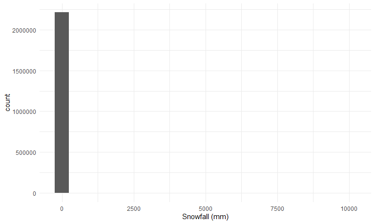
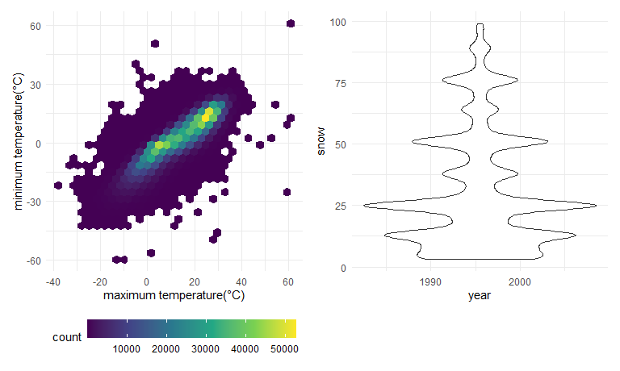
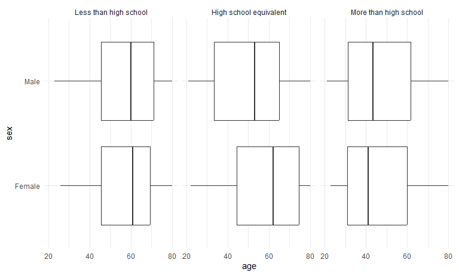

hw3_rw3031
================
Polly Wu (rw3031)
2024-10-05

## library and visual theme set up

# Problem 1

load the NY NOAA dataset

``` r
library(p8105.datasets)
data("ny_noaa")
```

### explore the NY NOAA dataset

``` r
nrow(ny_noaa)
```

    ## [1] 2595176

``` r
ncol(ny_noaa)
```

    ## [1] 7

``` r
summary(ny_noaa)
```

    ##       id                 date                 prcp               snow       
    ##  Length:2595176     Min.   :1981-01-01   Min.   :    0.00   Min.   :  -13   
    ##  Class :character   1st Qu.:1988-11-29   1st Qu.:    0.00   1st Qu.:    0   
    ##  Mode  :character   Median :1997-01-21   Median :    0.00   Median :    0   
    ##                     Mean   :1997-01-01   Mean   :   29.82   Mean   :    5   
    ##                     3rd Qu.:2005-09-01   3rd Qu.:   23.00   3rd Qu.:    0   
    ##                     Max.   :2010-12-31   Max.   :22860.00   Max.   :10160   
    ##                                          NA's   :145838     NA's   :381221  
    ##       snwd            tmax               tmin          
    ##  Min.   :   0.0   Length:2595176     Length:2595176    
    ##  1st Qu.:   0.0   Class :character   Class :character  
    ##  Median :   0.0   Mode  :character   Mode  :character  
    ##  Mean   :  37.3                                        
    ##  3rd Qu.:   0.0                                        
    ##  Max.   :9195.0                                        
    ##  NA's   :591786

``` r
ny_noaa |> 
  ggplot(aes(x = prcp)) + 
  geom_histogram()
```

    ## `stat_bin()` using `bins = 30`. Pick better value with `binwidth`.

    ## Warning: Removed 145838 rows containing non-finite outside the scale range
    ## (`stat_bin()`).


``` r
ny_noaa |> 
  ggplot(aes(x = snow)) + 
  geom_histogram()
```

    ## `stat_bin()` using `bins = 30`. Pick better value with `binwidth`.

    ## Warning: Removed 381221 rows containing non-finite outside the scale range
    ## (`stat_bin()`).


``` r
ny_noaa |> 
  ggplot(aes(x = snwd)) + 
  geom_histogram()
```

    ## `stat_bin()` using `bins = 30`. Pick better value with `binwidth`.

    ## Warning: Removed 591786 rows containing non-finite outside the scale range
    ## (`stat_bin()`).


There are 2595176 observations and 7 variables (id, date, prcp, snow,
snwd, tmax, tmin) in dataset. The variable tmax and tmin are imported as
character variable.

The earliest date for the data is 1981-01-01 and the most recent date is
2012-12-31.

Precipitation ranges from 0 to 22860 (tenths of mm) and 145838
observations do not report precipitation data. Snowfall range from -13
mm to 10160 mm, and 381221 observations’ data on snowfall is missing,
Snow depth range from 0 to 9195 mmm and 591786 observations do not have
snow depth data. All three variables are highly right skewed since there
are a lot of days that there is no rain or snow

``` r
ny_noaa = 
  ny_noaa|>
  mutate(
    tmax = as.numeric(tmax),
    tmin = as.numeric(tmin))

summary(ny_noaa)
```

    ##       id                 date                 prcp               snow       
    ##  Length:2595176     Min.   :1981-01-01   Min.   :    0.00   Min.   :  -13   
    ##  Class :character   1st Qu.:1988-11-29   1st Qu.:    0.00   1st Qu.:    0   
    ##  Mode  :character   Median :1997-01-21   Median :    0.00   Median :    0   
    ##                     Mean   :1997-01-01   Mean   :   29.82   Mean   :    5   
    ##                     3rd Qu.:2005-09-01   3rd Qu.:   23.00   3rd Qu.:    0   
    ##                     Max.   :2010-12-31   Max.   :22860.00   Max.   :10160   
    ##                                          NA's   :145838     NA's   :381221  
    ##       snwd             tmax              tmin        
    ##  Min.   :   0.0   Min.   :-389.0    Min.   :-594.0   
    ##  1st Qu.:   0.0   1st Qu.:  50.0    1st Qu.: -39.0   
    ##  Median :   0.0   Median : 150.0    Median :  33.0   
    ##  Mean   :  37.3   Mean   : 139.8    Mean   :  30.3   
    ##  3rd Qu.:   0.0   3rd Qu.: 233.0    3rd Qu.: 111.0   
    ##  Max.   :9195.0   Max.   : 600.0    Max.   : 600.0   
    ##  NA's   :591786   NA's   :1134358   NA's   :1134420

I change the character variable tmax and tmin into numeric instead.

There are more than 1100,000 observations that have the maximum and
minimum temperature missing within the dataset which is more than 40% of
the observations.

### cleaning the NY_NOAA data

I created separate variable for year, month, date and change the unit of
temperature and percipitation to degree celcius and mm.

``` r
ny_noaa=
ny_noaa|>
  mutate(
    year = year(date),
    month = month(date),
    day = day(date),
    tmax = tmax/10,
    tmin = tmin/10,
    prcp = prcp/10
  )
```

``` r
ny_noaa |> 
  ggplot(aes(x = snow)) + 
  geom_histogram(binwidth = 500)+
  labs(x = "Snowfall (mm)")
```

    ## Warning: Removed 381221 rows containing non-finite outside the scale range
    ## (`stat_bin()`).



For snowfall the most commonly observed value is 0 since except for cold
winter time there is not any snow.

### average temperatue in January and July

``` r
ny_noaa|>
  filter(month ==1 | month == 7)|>
  group_by(year,month)|>
  summarize(avg_tmax = mean(tmax, na.rm = TRUE))|>
  ggplot(aes(x = year, y=avg_tmax))+
  geom_point()+geom_line()+
  facet_grid(.~month)+
  labs( y = "average maximum temperature (°C)")
```

    ## `summarise()` has grouped output by 'year'. You can override using the
    ## `.groups` argument.


The average maximum temerpature in Janurary ranges from -5 degree
celcius to 5 degree celcius, while the average mamximum temperature in
July is around 25 to 30 degress celcius. The average maximum temperature
in January and July fluctuates a lot. The difference in average maximum
temperature in January across the years is greater than the difference
in average maximum temperature in July acorss the years. The years with
higher tmax in January tend to have higher tmax in July as well.

### tmax and tmin and distribution of snowfall

``` r
tmax_tmin_p=
ny_noaa|>
  ggplot(aes(x= tmax, y=tmin))+
  geom_hex()+
  theme(legend.position = "bottom", legend.key.width = unit(1,"null"))+
  labs(x = "maximum temperature(°C)", y = "minimum temperature(°C)")

snow_p=
ny_noaa|>
  filter(snow>0, snow<100)|>
  ggplot(aes(x=year, y=snow))+
  geom_violin()+
  theme()
  labs(x="snowfall (mm)")
```

    ## $x
    ## [1] "snowfall (mm)"
    ## 
    ## attr(,"class")
    ## [1] "labels"

``` r
tmax_tmin_p + snow_p 
```

    ## Warning: Removed 1136276 rows containing non-finite outside the scale range
    ## (`stat_binhex()`).


The distribution of the maximum and minimum temperature of the day tend
to follow a linear relationship, with higher maximum temperature, it
also tend to have higher minimum temperature. The distribution of
snowfall indicates that for the most common snowfall between 0 to 100 mm
is 25 mm.

# Problem 2

### import the datasets

#### tidy up and filter demographic data

``` r
demo =
  read_csv(file = "./nhanes_covar.csv", 
           skip = 4, na = c(".", "NA", ""))|>
  janitor::clean_names()|>
  filter(age >=21)|>
  drop_na()|>
  mutate(sex = as.factor(ifelse(sex == 2, "Female", "Male")),
         education = factor(education,
                            levels = c(1,2,3),
                            labels = c("Less than high school",
                                       "High school equivalent",
                                        "More than high school")))
```

    ## Rows: 250 Columns: 5
    ## ── Column specification ────────────────────────────────────────────────────────
    ## Delimiter: ","
    ## dbl (5): SEQN, sex, age, BMI, education
    ## 
    ## ℹ Use `spec()` to retrieve the full column specification for this data.
    ## ℹ Specify the column types or set `show_col_types = FALSE` to quiet this message.

#### import the accel data and merge

``` r
accel =
  read_csv(file = "./nhanes_accel.csv", na = c(".", "NA", ""))|>
  janitor::clean_names()
```

    ## Rows: 250 Columns: 1441
    ## ── Column specification ────────────────────────────────────────────────────────
    ## Delimiter: ","
    ## dbl (1441): SEQN, min1, min2, min3, min4, min5, min6, min7, min8, min9, min1...
    ## 
    ## ℹ Use `spec()` to retrieve the full column specification for this data.
    ## ℹ Specify the column types or set `show_col_types = FALSE` to quiet this message.

``` r
nhanes = 
  left_join(demo,accel, by="seqn")
```

### the number of men and women in each education category

``` r
nhanes|>
  group_by(education)|>
  count(sex)|>
  pivot_wider(
    values_from = n,
    names_from = sex
  )
```

    ## # A tibble: 3 × 3
    ## # Groups:   education [3]
    ##   education              Female  Male
    ##   <fct>                   <int> <int>
    ## 1 Less than high school      28    27
    ## 2 High school equivalent     23    35
    ## 3 More than high school      59    56

23 women and 35 men in the study have high school equivalent education.
28 women and 27 men in the study have less than high school education.
59 women and 56 men in the study have more than high school education.

### age distributions for men and women in each education category

``` r
nhanes|>
  ggplot(aes(x=age, y=sex))+
  geom_boxplot()+
  facet_grid(~ education)
```


The mean for age within the group with high school equivalent education
is higher in female compared to male, as well as the first and third
quartile. The distribution for age within the group with less than high
school education is quite equivalent across different sex group. The
first and third quartile of the age distribution for female and male in
the group with more than high school education is similar while the mean
for the female group is smaller.

### total daily activity

``` r
nhanes|>
  pivot_longer(
    min1:min1440,
    names_to = "mim_min",
    names_prefix = "min",
    values_to = "mims_value"
  )|>
  group_by(seqn, sex, age, education)|>
  summarize(total=sum(mims_value))|>
  ggplot(aes(x=age, y=total, color = sex))+
  geom_point()+geom_smooth()+
  facet_grid(~education)+
  labs(y="total daily activity")
```

    ## `summarise()` has grouped output by 'seqn', 'sex', 'age'. You can override
    ## using the `.groups` argument.
    ## `geom_smooth()` using method = 'loess' and formula = 'y ~ x'


In the group with less than high school education, the level of physical
activity decrease signficantly as age increases. Female in this group is
more active than man before 40 in this group. For the group with high
school equivalent education, the level of physical activity peaks at the
age of 40, and female is in general more active than man across all age.
In the group with more than high school education, both men and women’s
level of physical activity decrease only slightly overtime, and female
is in general more active than male.

``` r
nhanes|>
  pivot_longer(
    min1:min1440,
    names_to = "mim_min",
    names_prefix = "min",
    values_to = "mims_value"
  )|>
  mutate(mim_min = as.numeric(mim_min))|>
  group_by(sex, education)|>
  ggplot(aes(x=mim_min, y=mims_value, color = sex))+
  geom_point(alpha= 0.005)+geom_smooth(aes(color = sex), se=FALSE, size = 1.5)+
  facet_wrap(~education, nrow = 3)+
  scale_x_continuous(breaks = seq(0, 1440, by = 120))+
  scale_y_continuous(limit=c(0,30))+
  labs(x="time of a day(mins)", y="physical activity score")
```

    ## Warning: Using `size` aesthetic for lines was deprecated in ggplot2 3.4.0.
    ## ℹ Please use `linewidth` instead.
    ## This warning is displayed once every 8 hours.
    ## Call `lifecycle::last_lifecycle_warnings()` to see where this warning was
    ## generated.

    ## `geom_smooth()` using method = 'gam' and formula = 'y ~ s(x, bs = "cs")'

    ## Warning: Removed 1797 rows containing non-finite outside the scale range
    ## (`stat_smooth()`).

    ## Warning: Removed 1797 rows containing missing values or values outside the scale range
    ## (`geom_point()`).


Physcial activity level gradually increase around 360 minutes which is
around 6 am in all three education levels and peaks around 720 minutes
which is 12 pm. The level of physical activity gradually decrease after
1200 minutes which is 8 pm.

The female are in general more physcially active than male in the group
with more than high school education. Female in the group with high
school equivalent education group tend to be more physically active than
male in the morning. There is no difference in level of physical
activity across the day by sex for the group with less than high school
education.

# Problem 3

### import the datasets

``` r
jan2020 =
  read_csv(file = "./citibike/Jan 2020 Citi.csv", na = c(".", "NA", ""))|>
  janitor::clean_names()|>
  mutate(
    year = 2020,
    month = "January"
  )

jan2024 =
  read_csv(file = "./citibike/Jan 2024 Citi.csv", na = c(".", "NA", ""))|>
  janitor::clean_names()|>
  mutate(
    year = 2024,
    month = "January"
  )

july2020 =
  read_csv(file = "./citibike/July 2020 Citi.csv", na = c(".", "NA", ""))|>
  janitor::clean_names()|>
  mutate(
    year = 2020,
    month = "July"
  )

july2024 =
  read_csv(file = "./citibike/July 2024 Citi.csv", na = c(".", "NA", ""))|>
  janitor::clean_names()|>
  mutate(
    year = 2024,
    month = "July"
  )
```

``` r
citibike = 
  bind_rows(jan2020,july2020,jan2024,july2024)|>
  relocate(ride_id, year,month, weekdays)|>
  mutate(
    weekdays = factor(weekdays, 
                      levels =c("Monday", "Tuesday", "Wednesday", "Thursday", 
                                "Friday", "Saturday", "Sunday")),
    rideable_type= factor(rideable_type),
    month = factor(month, levels = c("January", "July")),
    member_casual = factor(member_casual)
  )
```

The citibike dataset has the following variables: ride_id, year, month,
weekdays, rideable_type, duration, start_station_name, end_station_name,
member_casual. There are a total of 99485 observations and 9 variables.

### total number of rides in each combination of year and month

``` r
citibike|>
  group_by(year, month, member_casual)|>
  summarize(total_rides = n())|>
  pivot_wider(
    names_from = "month",
    values_from = "total_rides"
  )
```

    ## `summarise()` has grouped output by 'year', 'month'. You can override using the
    ## `.groups` argument.

    ## # A tibble: 4 × 4
    ## # Groups:   year [2]
    ##    year member_casual January  July
    ##   <dbl> <fct>           <int> <int>
    ## 1  2020 casual            984  5637
    ## 2  2020 member          11436 15411
    ## 3  2024 casual           2108 10894
    ## 4  2024 member          16753 36262

In 2020, the total number of rides for casual riders is 984 in January
and 5637 in July, and the total number of rides for member riders is
11436 in January and 15411 in July.

### the 5 most popular starting stations for July 2024

``` r
citibike|>
  filter(
    month == "July",
    year == 2024
  )|>
  group_by(start_station_name)|>
  summarize(total_rides = n())|>
  arrange(desc(total_rides))|>
  head(5)
```

    ## # A tibble: 5 × 2
    ##   start_station_name       total_rides
    ##   <chr>                          <int>
    ## 1 Pier 61 at Chelsea Piers         163
    ## 2 University Pl & E 14 St          155
    ## 3 W 21 St & 6 Ave                  152
    ## 4 West St & Chambers St            150
    ## 5 W 31 St & 7 Ave                  146

The 5 most popular starting stations in July 2024 includes Pier 61 at
Chelsea Piers,  
University Pl & E 14 St, W 21 St & 6 Ave, West St & Chambers St and W 31
St & 7 Ave.

### the effects of day of the week, month, and year on median ride duration

``` r
citibike|>
  group_by(year, month, weekdays)|>
  summarize(median_ride_duration = median(duration))|>
  ggplot(aes(x=weekdays, y=median_ride_duration, color = month, group = month))+
  geom_point()+geom_line()+
  facet_grid(month~year)+
  labs(y= "median ride duration(min)")
```

    ## `summarise()` has grouped output by 'year', 'month'. You can override using the
    ## `.groups` argument.


In 2020, the median duration of rides is in general higher than the
median duration of rides in 2024, regardless of the month. The median
duration of rides in July is higher than the median duration of rides in
January in both years. The median duration of rides on weekends is
higher than the median duration of rides on weekdays in all combination
of year and month except for January 2024.

### impact of month, membership status, and bike type on the distrubtion of ride duration

``` r
citibike|>
  filter(year == 2024)|>
  ggplot(aes(x=duration,y=month,fill = month))+
  geom_boxplot()+
  facet_grid(member_casual~rideable_type)+
  labs(x= "ride duration(min)")
```


The duration of rides are highly right skewed regardeless of month, bike
type and rider type in 2024. There are a lot of outliers on the higher
end. The median duration is lower in January in comparison to July
regardless of bike type and rider type. There is not a signficant
difference in the distribution of ride duration comparing the classic
bike with electronic bike. The inter-quartile range for rides is wider
in the casual rider group compared to the member rider group.
